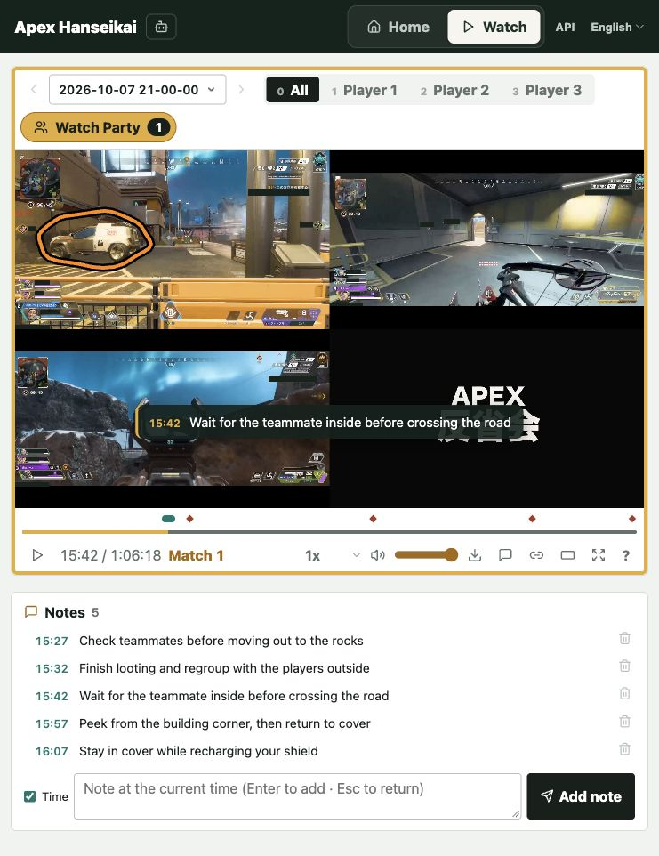

# Apex Hanseikai

A self-hosted app for reviewing Apex Legends recordings together. Watch Party syncs playback and player views, with timestamped notes and drawing. The home page keeps your team principles. English and Japanese UI.



## Quick start

With Docker running, start the app and upload an MP4:

```bash
docker run --rm -p 127.0.0.1:8080:8080 ghcr.io/hrs23/apex-hanseikai
```

Then open `http://localhost:8080`. [Details](https://hrs23.github.io/apex-hanseikai/docs/en/solo.html)

## Guides

[Solo](https://hrs23.github.io/apex-hanseikai/docs/en/solo.html) · [Squad of three (advanced)](https://hrs23.github.io/apex-hanseikai/docs/en/squad.html) · [日本語](https://hrs23.github.io/apex-hanseikai/docs/ja/)

[Development & API](docs/development.md) · [llms.txt](https://hrs23.github.io/apex-hanseikai/docs/llms.txt)

Not affiliated with Electronic Arts or Respawn Entertainment.

## License

[MIT](LICENSE)
